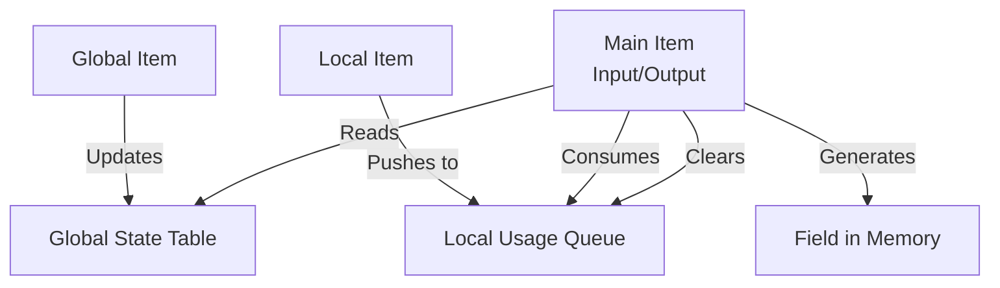
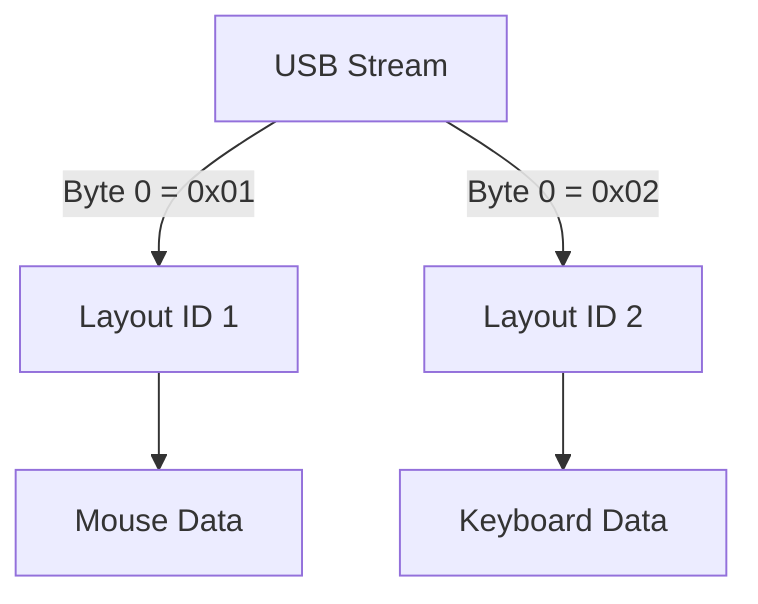

# Binary Anatomy of a Descriptor

To truly understand HID, you must stop looking at it as a list of fields and start seeing it as a **compiled bytecode**.

A Report Descriptor is a stream of instructions interpreted by the OS Kernel's HID Parser.

## 1. The Item Structure (The Atom)

Every instruction in the descriptor is called an **Item**. Most are "Short Items".
A Short Item consists of a **1-byte Header** followed by **0, 1, 2, or 4 bytes of Data**.

### The Header Byte
The header byte is packed with 3 pieces of information:

| Bit 7 | Bit 6 | Bit 5 | Bit 4 | Bit 3 | Bit 2 | Bit 1 | Bit 0 |
|:-----:|:-----:|:-----:|:-----:|:-----:|:-----:|:-----:|:-----:|
|  Tag  |  Tag  |  Tag  |  Tag  | **Type** | **Type** | **Size** | **Size** |

* **bSize (2 bits):** How many data bytes follow?
    * `00` = 0 bytes
    * `01` = 1 byte (`int8`)
    * `10` = 2 bytes (`int16`)
    * `11` = 4 bytes (`int32`)
* **bType (2 bits):** What category is this item?
    * `00` = Main
    * `01` = Global
    * `10` = Local
* **bTag (4 bits):** The specific opcode (e.g., `Usage Page`, `Input`).

> **Example:** `0x05` = `0000 01 01`
> * Size = 1 byte
> * Type = 1 (Global)
> * Tag = 0 (Usage Page)
> * **Result:** `Usage Page (Generic Desktop)`

---

## 2. The State Machine (Global vs Local)

This is the most critical concept. The parser maintains a **Current State** table.

### Global Items (Persistent State)
Items like `Usage Page`, `Logical Min`, `Report Size` update the **Global State**.   
- **Persistence:** Once set, a value remains valid for *all* subsequent items until it is changed.   
- *Optimization:* This is why we don't repeat `Usage Page` for every button.

### Local Items (Volatile Stack)
Items like `Usage`, `Usage Min`, `Designator` go into a **Local Queue**.
* **Persistence:** They apply **ONLY** to the very next Main Item (`Input`/`Output`/`Feature`).
* **Reset:** After a Main Item is executed, the Local Queue is **cleared**.

### Main Items (The Trigger)
Items like `Input`, `Output`, `Feature` trigger the creation of fields.
When the parser sees an `Input` tag:
1.  It takes the current **Global State** (Size, Count, Min, Max).
2.  It takes the **Local Queue** (Usages).
3.  It generates `ReportCount` fields.
4.  **It clears the Local Queue.**

-----

## 3. Report Types (The Data Flow)

A device communicates using three distinct channels (Report Types).

| Type | Direction | Purpose | Behavior |
| :--- | :--- | :--- | :--- |
| **Input** | Device -> Host | Data (Buttons, Axis) | **Interrupt/Polled.** Sent only when data changes (or per poll interval). |
| **Output** | Host -> Device | Actuators (LEDs, Rumble) | **Async/Sync.** Sent by the OS driver when the application requests it. |
| **Feature** | Bidirectional | Configuration (Settings) | **Synchronous.** Used for getting/setting device parameters (e.g., DPI, Firmware Version). |

> **Note:** In `hid-declarative`, `Input` items define what you read via `live` or `decode`. `Output` items define what you can send.

-----

## 4. Report IDs (Multiplexing)

How can a single USB endpoint carry Mouse data (3 bytes) and Keyboard data (8 bytes)?

The `Report ID` (Global Item `0x85`) acts as a **Protocol Switch**.

### Without Report ID

The payload starts immediately at bit 0.
`[ Button ] [ X ] [ Y ]`

### With Report ID

The payload is prefixed by 1 byte containing the ID.

  * **Packet A:** `[ 0x01 ] [ Button ] [ X ] [ Y ]`
  * **Packet B:** `[ 0x02 ] [ Key Mod ] [ Key Array... ]`

When the OS (or `hid-declarative`) receives the packet, it looks at the first byte:

1.  Is it `0x01`? -\> Use the Mouse Layout.
2.  Is it `0x02`? -\> Use the Keyboard Layout.

**Implication:**

  * Report IDs reset the bit offset counter.
  * Fields in Report 1 do not overlap with fields in Report 2; they exist in parallel universes.

<!-- end list -->

