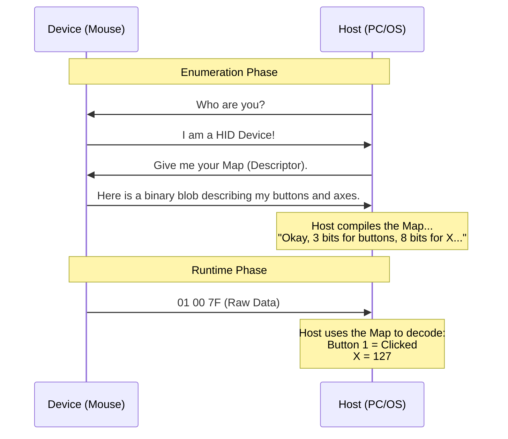

# HID 101: The Protocol Primer

Welcome to the world of **Human Interface Devices**.

If you have ever wondered how your computer knows that *this* USB cable is a Mouse and *that* one is a Joystick, without installing any driver... you are in the right place.

## The "Self-Describing" Magic

In older protocols (like Serial/RS232), the computer and the device had to agree on a format beforehand.
> *"I will send you 8 bytes. Byte 1 is X, Byte 2 is Y..."*

If the device changed, the driver broke.

**HID flips the script.** When you plug in a HID device, the first thing it says is not "Here is data", but **"Here is who I am"**.

It sends a **Report Descriptor** (a map) that explains how to read its future messages.

-----

## The Three Pillars of HID

To understand HID, you need to capture three concepts.

### 1\. The Report Descriptor (The Map)

This is a static block of binary data. It describes the **structure** of the data packets. It defines:

  * **What** the data represents (e.g., "X Axis", "Fire Button").
  * **How** the data is formatted (e.g., "8-bit integer", "1-bit boolean").
  * **Where** it is located in the packet (implicit offset).

### 2\. The Usage Tables (The Vocabulary)

HID uses standard codes to identify functions. These are called **Usages**.
Instead of sending the string "Volume Up", the device sends a standardized code.

  * **Generic Desktop Page (0x01)**: Includes Mouse, Keyboard, Joystick, X, Y, Z.
  * **Button Page (0x09)**: Button 1, Button 2, etc.
  * **Consumer Page (0x0C)**: Media keys (Play, Pause, Volume).

> **Fun Fact:** There are Usages for almost everything, including "Magic Carpet Simulation", "Submarine", and "Gun Turret".

### 3\. The Report (The Payload)

This is the actual data packet sent during operation. It is extremely compact. It contains **no metadata**, only raw values packed together as tightly as possible.

-----

## Anatomy of a Descriptor

A Descriptor is a program written in a simple language. It consists of **Items**.

### Global Items (The Context)

They set the state for everything that follows.

  * `Usage Page`: "I am now talking about Buttons".
  * `Logical Min/Max`: "The following values are between -127 and 127".
  * `Report Size`: "The following fields are 8 bits wide".

### Local Items (The Labels)

They apply only to the next main item.

  * `Usage`: "This field represents the X Axis".

### Main Items (The Action)

They generate the fields in the report based on the current State and Labels.

  * `Input`: "Create a field here (Device -\> Host)".
  * `Output`: "Create a field here (Host -\> Device, e.g., LED)".

### Example Visualization

Imagine a descriptor as a recipe:

| Instruction | Meaning | Effect |
| :--- | :--- | :--- |
| **GLOBAL** | Set Size to 1 bit | `Size = 1` |
| **GLOBAL** | Set Count to 3 | `Count = 3` |
| **LOCAL** | Tag next as "Button" | `Current_Usage = Button` |
| **MAIN** | **Create Input** | **Generates 3 fields of 1 bit (Buttons)** |
| **GLOBAL** | Set Size to 5 bits | `Size = 5` |
| **MAIN** | **Create Input (Const)** | **Generates 5 bits of Padding** |

**Total:** 3 bits + 5 bits = 8 bits (1 Byte).

-----

## Why is `hid-declarative` needed?

Writing a descriptor manually is painful because:

1.  **It is Stateful:** You have to remember that 10 lines ago, you set the `Report Size` to 4.
2.  **It is packed:** If you miss 2 bits of padding, your byte alignment shifts, and your "X Axis" reads garbage.
3.  **It is obscure:** `0x05 0x01 0x09 0x06...` is not readable.

`hid-declarative` handles the state machine, calculates the padding, and lets you use human-readable names.

Instead of writing assembly-like instructions, you define the **Goal** (Schema), and we generate the **Instructions** (Spec).
