---

---

# HID Declarative

<p align="center">
  <strong>The modern, type-safe Python stack for USB HID.</strong>
  <br>
  <em>Define in Python. Compile to Binary. Run anywhere.</em>
</p>

<p align="center">
  <a href="https://pypi.org/project/hid-declarative" target="_blank">
    
  </a>
  <a href="https://pypi.org/project/hid-declarative" target="_blank">
    
  </a>
</p>

---

**HID Declarative** solves the pain of working with USB Human Interface Devices. 
It acts as a bridge between **High-Level Logic** (Python Objects) and **Low-Level Protocol** (Binary Reports).

## Choose your path

<div class="grid cards" markdown>

-   :material-raspberry-pi: **For Makers & Hobbyists**

    Create custom USB gadgets (Mouse, Keyboard, Gamepad) using Python. No more hex editing.

    [:octicons-arrow-right-24: Create a Mouse](learn/maker/mouse.md)

-   :material-magnify: **For Security & Reversing**

    Dump descriptors from real devices (`/dev/hidraw`), inspect their internal layout, and analyze traffic logs.

    [:octicons-arrow-right-24: Inspect Hardware](how-to/dump_linux.md)

-   :material-robot: **For DevOps & QA**

    Automate hardware testing. Simulate user inputs and verify device behavior without physical hardware using the Runtime Codec.

    [:octicons-arrow-right-24: Automation Guide](learn/devops/automation.md)

</div>

## How it works

You define the **Schema**, the library handles the **Bytecode**.

```mermaid
flowchart LR

    Input[/"🐍 Python - Profile"/]
    
    Tool{{"HID - Declarative"}}
    
    Bin[("Binary - .bin")]
    Code["Firmware - .c /.rs"]
    Live((("Live - Monitor")))

    Input ==> Tool
    Tool --> Bin
    Tool --> Code
    Tool -.-> Live
```




## Quick Example

Define a mouse in **15 lines of Python** instead of **60 bytes of Hex**.

```python
import hid_declarative as hid

# Import specific submodules for brevity
from hid_declarative import schema
from hid_declarative.schema import widgets
from hid_declarative import spec

# 1. Define
profile = hid.HIDProfile(
    # Logical structure -> schema
    root=schema.Collection(
        # Constants -> spec
        usage_page=spec.GenericDesktop.PAGE_ID,
        usage=spec.GenericDesktop.MOUSE,
        type_id=spec.CollectionType.APPLICATION,
        
        children=[
            # Abstractions -> widgets
            widgets.ButtonArray(3),
            widgets.Padding(5),
            
            widgets.Axis(spec.GenericDesktop.X),
            widgets.Axis(spec.GenericDesktop.Y),
            widgets.Axis(spec.GenericDesktop.WHEEL)
        ]
    ),
    name="MyMouse",
    auto_pad=True
)

# 2. Compile via CLI
# $ hid-declarative compile mouse.py:profile --format c
```
??? tip "Learn More"
    [Get Started in 5 minutes](learn/quickstart.md) { .md-button .md-button--primary }

