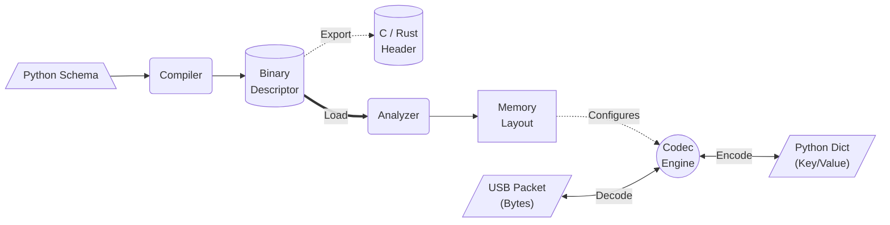

# Quick Start

In this guide, we will define a simple Mouse, compile it to binary, and simulate a click.

## 1. Define your Device

Create a file named `my_mouse.py`:

```python
from hid_declarative import (
    HIDProfile, Collection, Axis, ButtonArray, 
    GenericDesktop, CollectionType
)

# Define the Logical Structure
mouse_def = Collection(
    usage_page=GenericDesktop.PAGE_ID,
    usage=GenericDesktop.MOUSE,
    type_id=CollectionType.APPLICATION,
    children=[
        Collection(
            usage_page=GenericDesktop.PAGE_ID,
            usage=GenericDesktop.POINTER,
            type_id=CollectionType.PHYSICAL,
            children=[
                ButtonArray(3),           # 3 Buttons
                Axis(GenericDesktop.X),   # X Movement
                Axis(GenericDesktop.Y),   # Y Movement
            ]
        )
    ]
)

# Export the Profile
profile = HIDProfile(mouse_def, name="MyFirstMouse", auto_pad=True)
```


## 2. Inspect and Compile
Use the CLI to verify your design.

```bash
# Check the memory layout
hid-declarative inspect my_mouse.py:profile
```

Output:
```plaintext
Bits    Name      Type   Min   Max
0..0    Button_1  input    0     1
1..1    Button_2  input    0     1
2..2    Button_3  input    0     1
8..15   X         input -127   127
16..23  Y         input -127   127
```

If you are happy, compile it to C code for your firmware:

```bash
hid-declarative compile my_mouse.py:profile --format c -o usb_desc.h
```

## 3. Simulate Input
You don't need hardware to test your logic. Use the encode command to generate a valid USB report.

```bash

# Simulate: Click Left Button + Move X to 100
hid-declarative encode my_mouse.py:profile '{"Button_1": true, "X": 100}'
```

Output: 
> 01 64 00 (Hexadecimal report ready to be sent).


